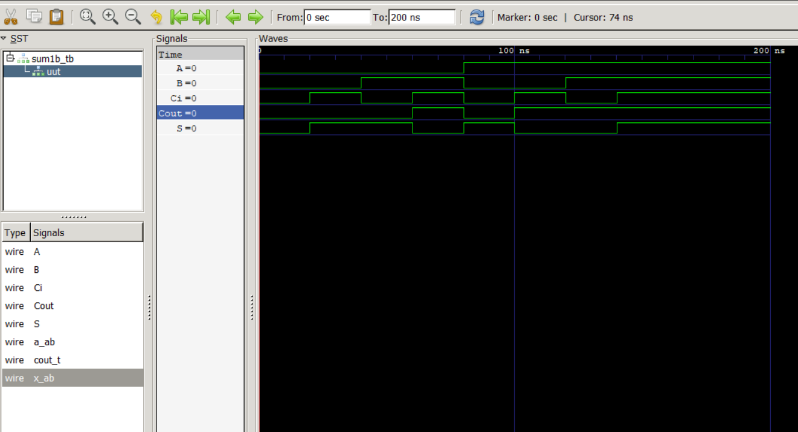

 ## Integrantes
* Steven Caro 
* Jorge Andres Barandica
* Diego Alejandro Olaya

 ## Documentación
 # ¿Cómo Funciona el Código de Sumador de 1 Bit?

Este código define un módulo llamado ´sum1b´, que representa un sumador de 1 bit con acarreo. Los sumadores de 1 bit son bloques básicos utilizados en circuitos aritméticos, como los sumadores completos, que suman dos números binarios.

# Explicación Paso a Paso

 ## 1. Definición del Módulo:

Un módulo en Verilog encapsula una parte del diseño del hardware, que puede ser tan simple como una puerta lógica o tan complejo como un microprocesador. Dentro del módulo, se puede definir las entradas y salidas, los comportamientos y la lógica que se necesita para implementar una funcionalidad específica. En este código el modulo recibe el nombre de `sum1b`

Las entradas se asignan con la palabra reservada `input` seguido del nombre que se desea en este caso las entradas serán `A` y `B` caso similar ocurre con la salida, tan solo que se usa la palabra reservada `output` las salidas en este codigo son `sum` y `Cout`. En un módulo Verilog, si una entrada o salida se declara sin un rango de bits, se considera que es de 1 bit. En este caso, tanto `A` como `B` son señales de 1 bit.

Para hacer que una entrada, salida o una variable interna sea de más de 1 bit, se debe especificar un rango de bits entre corchetes `[]`. El formato general es: 
```
[input/output/variable] [n:0] nombre;
```
Donde, n:0: Define el rango de bits. n es el bit más significativo (MSB, por sus siglas en inglés) y 0 es el bit menos significativo (LSB, por sus siglas en inglés). Si n es igual a 3, por ejemplo, entonces la variable tendrá 4 bits (3, 2, 1, 0).

Una variable importante para el sumador de 4 bits es la entrada `Ci`: El bit de acarreo de entrada, que es el acarreo que viene de una suma anterior (si estuvieras sumando múltiples bits). Esta entrada se detallará en la explicación del codigo de sumador de 4b. Con todo lo anterior se aclara que: 

   + `A` y `B`: Los dos bits que se quieren sumar.
   + `Ci`: El bit de acarreo de entrada, que es el acarreo que viene de una suma anterior.
   + `sum`: El resultado de la suma de `A`, `B` y `Ci`.
   + `Cout`: El bit de acarreo de salida, que se envía al siguiente dígito de mayor orden en una suma binaria de varios bits.

## 2. Declaración de una Variable Interna:
```
reg [1:0] result: 
```
Esta línea declara una variable llamada result que puede almacenar dos bits (ya que el tamaño está definido por [1:0]). Esta variable almacenará el resultado de la suma. reg indica que `result` puede cambiar su valor a lo largo del tiempo y es utilizada dentro de un bloque secuencial como el que veremos.

 ## 3. Asignación de las Salidas:
```
    assign Sum = result[0];
    assign Cout = result[1];
```
+ assign: Esta palabra clave se usa para asignar valores a señales de salida.

+ Sum = result[0]: Aquí, se está asignando el primer bit (result[0]) de `result` al `Sum`. Este bit es el resultado de la suma.
+ Cout = result[1]: Aquí, se está asignando el segundo bit (result[1]) de `result` a `Cout`, que es el bit de acarreo de salida.

Esta parte del código tiene relevancia cuando hacemos una suma binaria de 1 + 1 esto siempre da como resultado 10.

###    Suma Binaria Básica

En aritmética binaria:
```
0 + 0 = 0
0 + 1 = 1
1 + 0 = 1
1 + 1 = 10 (que es 2 en decimal)

```
La operación 1 + 1 es especial porque el resultado no cabe en un solo bit. En binario, 1 + 1 genera un resultado de "10".

+ El "0" es el resultado de la suma (Sum).
+ El "1" es el acarreo (Carry Out).

Esto es importante porque sin manejar correctamente el acarreo, no se podría realizar sumas binarias correctas. Por ejemplo, en un sumador de 4 bits, el acarreo de un bit menos significativo podría afectar el siguiente bit.

##SS 4. El Bloque always:
```
    always@(*) begin
      result = A+B+Ci;
    end
```
* `always@(*)`: Este bloque indica que el código dentro de él se ejecutará siempre que cambie alguna de las señales de entrada (`A`, `B`, o `Ci`). El asterisco `(*)` es un comodín que significa "escuchar cambios en cualquiera de las señales de entrada".
+ result = A + B + Ci;: Aquí es donde ocurre la suma. El código suma `A`, `B`, y `Ci`, y almacena el resultado en `result`. Como `result` tiene dos bits, puede almacenar tanto el bit de suma (Sum) como el bit de acarreo (Cout).
+ begin y end: Delimitan el bloque de código que se ejecuta dentro del bloque always.


## Simulación
Para la simulación se tiene que 
